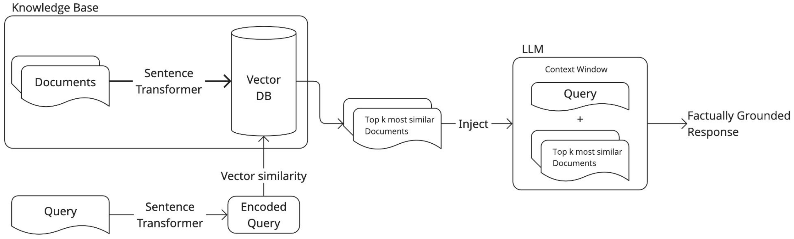

# Chapter 5. **RAG Pipeline for Automatic Text Classification**
In this chapter, we will explore an alternative approach to text classification building a simple **retrieval-augmented generation** (RAG) system. This chapter will cover:
* Building a **knowledge base** using official NACE category descriptions.
* **Retrieving** the `top_k` relevant categories based on a **natural language query**.
* Using a **large language model** (LLM) to make the final classification.

